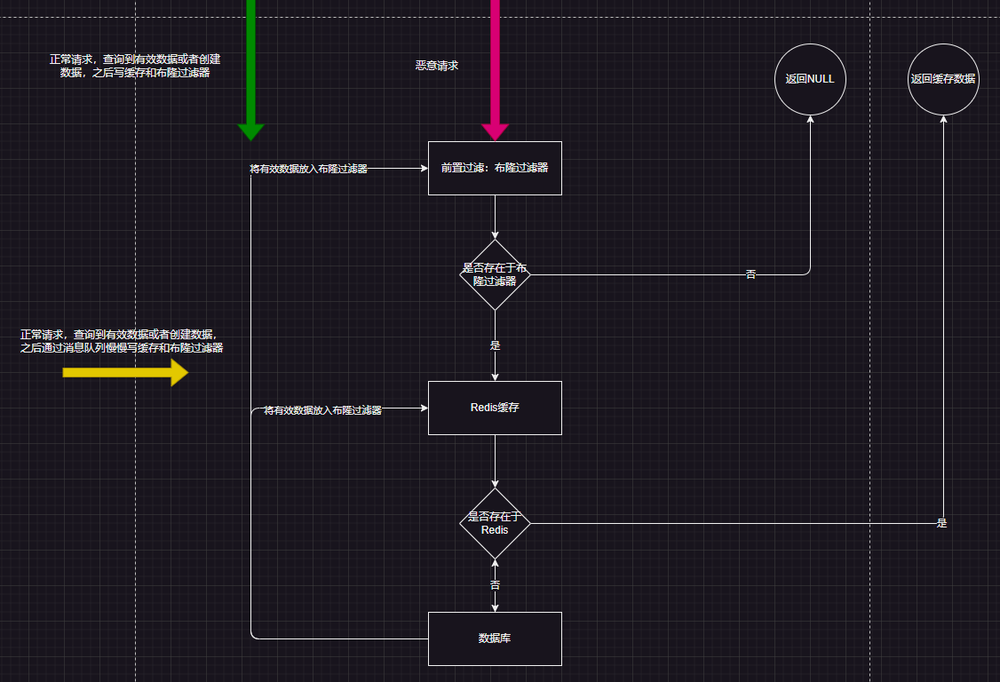

# redis-bloom-practice
布隆过滤器最佳实践
# 设计方案
假阳率我们一般不使用，业务中只使用布隆过滤器的100%阴

> 对于 BloomFilter 判断不存在的 key ，则是 100% 不存在的

这一特性我们就用来过滤非法数据：

- 或者在数据库之前过滤非法数据
- 或者在缓存之前过滤非法数据（缓存穿透解决方案）

> 缓存穿透：意味着有特殊请求或者黑客攻击，在查询一个不存在的数据，**即数据不存在 Redis 也不存在于数据库。**



# 测试程序
程序代码见：[DebugBloomApplicationTests.java](debug-bloom%2Fsrc%2Ftest%2Fjava%2Forg%2Flyflexi%2Fdebugbloom%2FDebugBloomApplicationTests.java)

- bloomMistake()：测试假阳数
- bloomFilter()：测试过滤器，过滤非法数据

# docker脚本

创建宿主机目录

```shell
mkdir -p /root/datamapping/rebloom/data
mkdir -p /root/datamapping/rebloom/config
mkdir -p /root/datamapping/rebloom/logs
```

创建redis.conf

```shell
# 基本配置，注意是容器内的默认端口，不是对外暴露的端口！
port 6379
bind 0.0.0.0

# 数据持久化
dir /data
appendonly yes

# 关闭保护模式
protected-mode no

```

执行命令

```shell
docker run -p 6479:6379 \
--name redis-bloom \
-d --restart=always \
-e TZ="Asia/Shanghai" \
 -v /root/datamapping/rebloom/config/redis.conf:/usr/local/etc/redis/redis.conf \
 -v /root/datamapping/rebloom/data:/var/lib/redis \
 -v /root/datamapping/rebloom/log:/var/log/redis \
 redislabs/rebloom:2.2.2 \
 /usr/local/bin/redis-server /usr/local/etc/redis/redis.conf \
 --appendonly yes\
 --loadmodule "/usr/lib/redis/modules/redisbloom.so"

```

设置自动启动

```shell
docker update redis-bloom --restart=always

```

shell中测试布隆过滤器命令：

```shell
[root@localhost ~]# docker exec -it redis-bloom /bin/sh
# redis-cli MODULE LIST
1) 1) "name"
   2) "bf"
   3) "ver"
   4) (integer) 20202
# redis-cli
127.0.0.1:6379> BF.ADD myfilter "hello"
(integer) 1
127.0.0.1:6379> BF.EXISTS myfilter "hello"
(integer) 1
127.0.0.1:6379> BF.EXISTS myfilter "world"
(integer) 0
127.0.0.1:6379> exit
# 

```